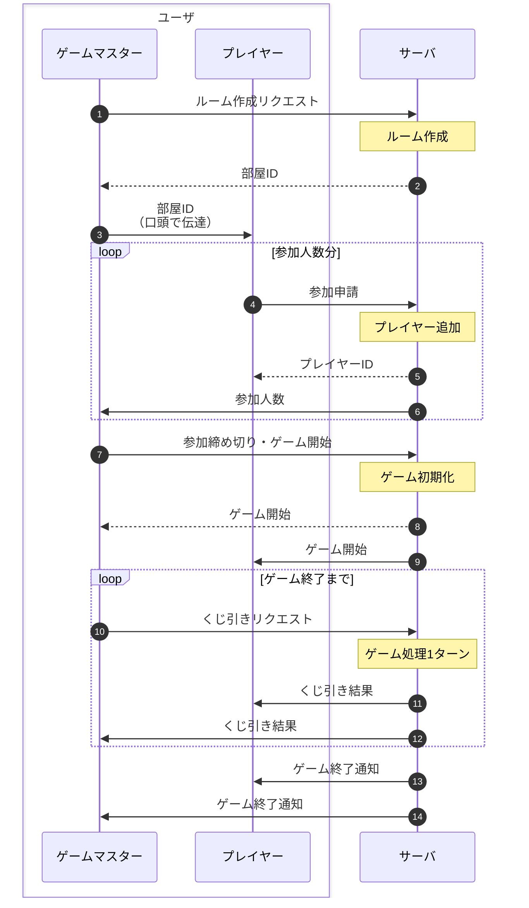
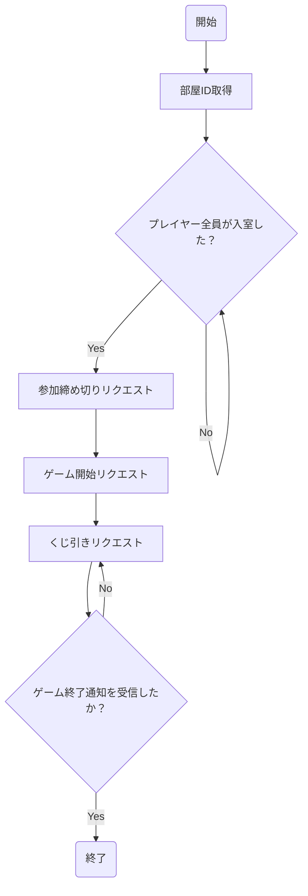
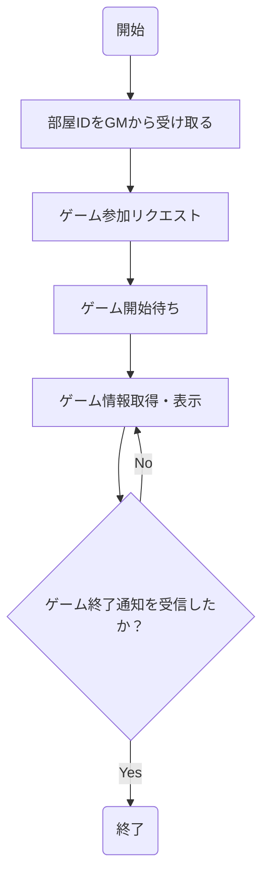
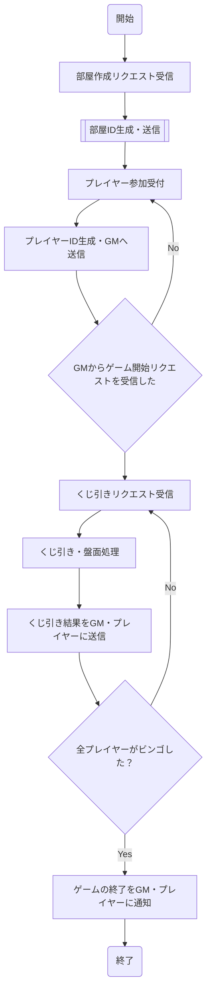

## 全体シーケンス図

```mermaid
sequenceDiagram
autonumber
box ユーザ
participant ゲームマスター
participant プレイヤー
end
participant サーバ

ゲームマスター->>サーバ: ルーム作成リクエスト
Note over サーバ: ルーム作成
サーバ-->>ゲームマスター: 部屋ID
ゲームマスター->>プレイヤー: 部屋ID<br>（口頭で伝達）
loop 参加人数分
プレイヤー->>サーバ: 参加申請
Note over サーバ: プレイヤー追加
サーバ-->>プレイヤー: プレイヤーID
サーバ->>ゲームマスター: 参加人数
end
ゲームマスター->>サーバ: 参加締め切り・ゲーム開始
Note over サーバ: ゲーム初期化
サーバ-->>ゲームマスター: ゲーム開始
サーバ->>プレイヤー: ゲーム開始
loop ゲーム終了まで
ゲームマスター->>サーバ: くじ引きリクエスト
Note over サーバ: ゲーム処理1ターン
サーバ->>プレイヤー: くじ引き結果
サーバ->>ゲームマスター: くじ引き結果
end
サーバ->>プレイヤー: ゲーム終了通知
サーバ->>ゲームマスター: ゲーム終了通知
```

## ゲームマスター

```mermaid
flowchart
start(開始)-->
createroom[部屋ID取得]-->
wait{プレイヤー全員が入室した？}-- No -->wait
wait -- Yes --> 
simekiri[参加締め切りリクエスト] -->
startgame[ゲーム開始リクエスト]-->
kujibiki[くじ引きリクエスト]-->
kujikekka{ゲーム終了通知を受信したか？}-- No -->kujibiki
kujikekka-- Yes -->
End(終了)
```

## プレイヤー

```mermaid
flowchart
start(開始)-->
roomid[部屋IDをGMから受け取る]-->
joingame[ゲーム参加リクエスト]-->
wait[ゲーム開始待ち]-->
getstatus[ゲーム情報取得・表示]-->
loopgame{ゲーム終了通知を受信したか？}-- No -->getstatus
loopgame-- Yes -->
End(終了)
```

## サーバ

```mermaid
flowchart
start(開始)-->
createroom[部屋作成リクエスト受信]-->
genroomid[[部屋ID生成・送信]]-->
joingame[プレイヤー参加受付]-->
sendplayerid[プレイヤーID生成・GMへ送信]-->
startgame{GMからゲーム開始リクエストを受信した}-- No -->joingame
startgame-->
kujireq[くじ引きリクエスト受信]-->
checkboard[くじ引き・盤面処理]-->
sendkuji[くじ引き結果をGM・プレイヤーに送信]-->
allplayersfinished{全プレイヤーがビンゴした？}-- No -->kujireq
allplayersfinished-- Yes -->
gameend[ゲームの終了をGM・プレイヤーに通知]-->
End(終了)
```